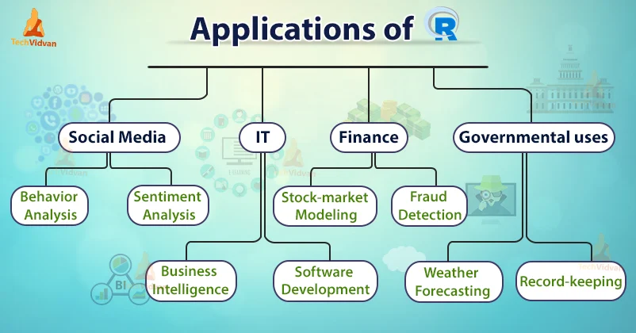

# Introduction to R Programming

### What is it?

R is a programming language widely used especially in data science. It
is possible to do data mining, data processing, statistical programming
and machine learning with it. It is a leading language, especially among
researchers in natural or social sciences.

### Why R?

-   Completely free and open source

-   Open science and scientific reproducibility

-   Customized analyses

### How will we code?

Throughout the workshop, we will use RStudio by Posit, which is the most
popular IDE for R. There are also other options like RStudio Cloud or
Google Colab that allow you to write code in your web browser.

### Cheat sheets

**Base R:**

<https://iqss.github.io/dss-workshops/R/Rintro/base-r-cheat-sheet.pdf>

**Data manipulation with tidyverse:**

<https://www.rstudio.com/wp-content/uploads/2015/02/data-wrangling-cheatsheet.pdf>

**Introduction book:**

[https://intro2r.com](https://intro2r.com/simple-base-r-plots.html){.uri}

**Turkish cheat sheets:**

<https://github.com/rstudio/cheatsheets/blob/main/translations/turkish/base-r_tr.pdf>
<https://github.com/rstudio/cheatsheets/blob/main/translations/turkish/data-transformation_tr.pdf>
<https://github.com/rstudio/cheatsheets/blob/main/translations/turkish/data-visualization_tr.pdf>

**Also see [DataCamp](http://datacamp.com)!**

### Real world use cases of R:

{width="600"}

### Python vs. R?

{width="300"}

## Let's start coding!

```{r}
# Addition
2 + 2

# Subtraction
3 - 2

# Multiplication
3 * 2

# Division
3 / 2

# Exponentiation
2 ^ 5

# Order of operations
2 + 3 * 4
(2 + 3) * 4
```

## Functions in R

In R, instead of using mathematical operators like this, we will
primarily use "functions" that allow us to perform various tasks. Each
function takes specific arguments. Arguments are the inputs to the
function, i.e., the objects on which the function operates. Some of
these arguments may be required to be explicitly specified. If a
function requires multiple arguments, the arguments are separated by
commas.

Functions are a way to package up and reuse code.

The function below is called "add_two" and it adds two to any number you
give it.

```{r}
add_two <- function(x) {
  x + 2
}
```

Now we can use the function we just created.

```{r}
add_two(3)
```

Other functions are built into R. For example, the "log" function
computes the natural logarithm.

```{r}
log(10)
sqrt(4)
abs(-2)
```

You can also use functions inside other functions.

```{r}
log(sqrt(4))
```

## Variables in R

A variable in a computer's memory can be any object that is defined. We
can give it any name and value we want. The computer stores the values
we assign to variables in memory, and later, we can access the values
within that variable.

In R, we assign variables using the \<- operator.

```{r}
# this code will not produce any output but will assign the value 100 to the variable 'var'
var <- (2*5)^2

# if we want to see the value of the variable, we can just type the name of the variable or print it to the console
var
print(var)
```

### Operations with variables

```{r}
# we can use variables in operations
var + 1

var2 <- sqrt(16)

var2 + var

var2 * var
```

### Logical operators

Using the \<, \>, \<=, \>=, ==, !=, \|, and & operators, we can perform
comparisons between two variables. As a result, these operators will
give us either TRUE, meaning the comparison is true, or FALSE, meaning
the comparison is false.

```{r}
var < 105 # smaller than
 
var > 1 # bigger than

var <= 8 # smaller than or equal to

var >= 8 # bigger than or equal to

var == 8 # equal to

var != 6 # not equal to

var == 4 | 8 # either 4 or 8

var == 4 & 8 # both 4 and 8
```

Note: You can always get help about a specific function or operator by
using the help() command.

```{r}
help(log)

help("+")
```

## Data types in R

In R, values can have different types. The main data types include
integer, double (for real numbers), character, and logical. You can use
the typeof() function to determine the data type of a variable.

Here's an example:

```{r}
var <- as.integer(2)
var2 <- 2.2
var3 <- "hey learning R is cool"
var4 <- TRUE

typeof(var)
typeof(var2)
typeof(var3)
typeof(var4)
```

### Vectors

#### Numeric vectors

A vector is a collection of values of the same type. We can create a
vector using the c() function. The c() function takes any number of
arguments and combines them into a vector.

```{r}
# create a vector of numbers
numbers <- c(1, 2, 3, 4, 5)

print(numbers)

# use length() to get the length of a vector
length(numbers)

# consecutive numbers can be created using the : operator
5:90

# or use seq() to create a sequence of numbers
seq(5, 90, by = 2)

# use rep() and seq() to create a vector of repeated numbers
rep(seq(1,10,3),5)
```

Some functions that you can use with numeric vectors:

```{r}
# sum() adds up all the numbers in a vector
sum(numbers)

# mean() computes the mean of all the numbers in a vector
mean(numbers)

# max() and min() return the maximum and minimum values in a vector
max(numbers)
min(numbers)

# sort() sorts the numbers in a vector in ascending order
sort(numbers)

# you can also sort in descending order
sort(numbers, decreasing = TRUE)

# sd() computes the standard deviation of the numbers in a vector
sd(numbers)

# median() computes the median of the numbers in a vector
median(numbers)
```

#### Operations with vectors:

```{r}
# you can add two vectors together
numbers + c(1, 2, 3, 4, 5)

# you can multiply two vectors together
numbers * c(1, 2, 3, 4, 5)
```

#### Indexing vectors:

```{r}
# you can access the elements of a vector using the [] operator
new_vector <- 7:21

new_vector[1]
new_vector[2:7]
new_vector[c(1, 3, 5, 7)]
new_vector[-1]
new_vector[-(1:3)]
```

#### Logical vectors

Logical vectors are vectors that contain TRUE and FALSE values. You can
create logical vectors using the c() function.

```{r}
# create a logical vector
logical_vector <- c(TRUE, FALSE, TRUE, FALSE, TRUE)

# operators like <, >, <=, >=, ==, !=, |, and & can be used to create logical vectors
new_vector <- 1:8

new_vector < 3

new_vector == 7

new_vector != 0
```

#### Filtering vectors:

```{r}
# you can use logical vectors to filter other vectors

new_vector[new_vector < 3] # returns all values in new_vector that are smaller than 3

new_vector[new_vector == 7] # returns all values in new_vector that are equal to 7

```

#### Character vectors

Character vectors are vectors that contain strings. You can create
character vectors using the c() function.

```{r}
# create a character vector
character_vector <- c("hello", "learning", "R", "is", "cool")
print(character_vector)

# you can use the nchar() function to get the number of characters in each string
nchar(character_vector)

# you can use the paste() function to concatenate strings
paste("hello", "learning", "R", "is", "cool")

# you can use the strsplit() function to split a string into a vector of substrings
strsplit("hello learning R is cool", " ")
```

### Data frames

Data frames are used to store tabular data. You can create a data frame
using the data.frame() function.

```{r}
# create a data frame
df <- data.frame(
  age = c(55, 95, 67, 89, 24),
  height = c(1.78, 1.65, 1.90, 1.45, 1.67)
)

print(df)

# you can use the $ operator or [] to access a column in a data frame
df$age
df['age']

```

**There are some in-built datasets in R like state.x77.** You can use
`data()` to view other available datasets in R.

This is a matrix with 50 rows and 8 columns giving the following
statistics in the respective columns.

-   *Population*: population estimate as of July 1, 1975.

-   *Income*: per capita income (1974)

-   *Illiteracy*: illiteracy (1970, percent of population)

-   *Life Exp*: life expectancy in years (1969-71)

-   *Murder*: murder and non-negligent manslaughter rate per 100,000
    population (1976)

-   *HS Grad*: percent high-school graduates (1970)

-   *Frost*: mean number of days with minimum temperature below freezing
    (1931-1960) in capital or large city

-   *Area*: land area in square miles

*Source:* U.S. Department of Commerce, Bureau of the Census
(1977) *Statistical Abstract of the United States*, and U.S. Department
of Commerce, Bureau of the Census (1977) *County and City Data Book*.

```{r klippy, echo=FALSE}
klippy::klippy(position = c('top', 'right'))

```

```{r, warning=FALSE, message=FALSE}
# save the dataset to a variable as a dataframe object in R
df <- as.data.frame(state.x77)

# view the df:
#View(state.x77)
head(state.x77) 
tail(state.x77)

# you can use the str() function to get information about the structure of a data frame
str(df)

# you can use the summary() function to get summary statistics about a data frame
summary(df)

# get the dimension
dim(df)

```

## Quick visualization

Let's create some dummy data and visualize it.

```{r}

x <- 0:10
y <- x^2

# you can use the plot() function to create a scatter plot
plot(x, y, 
     xlab = "X-axis title",
     ylab = "Y-axis title")

# simulate different data
teams <- c("Team A", "Team B", "Team C", "Team D", "Team E") # generating team names

scores <- sample(50:100, length(teams)) # generating the scores for each team

# bar plot
barplot(scores, 
        main = "Scores by Teams",
        xlab = "Teams",
        ylab = "Scores",
        col = "lightgreen",
        border = "black",
        names.arg = teams)

```

We will learn later how to create more advanced visualizations using the
ggplot2 package.

## In-Class Exercises

### Exercise 1

Today is Monday. What day of the week will it be 9, 54, 306, and 8999
days from now?

Note: Create a character vector containing the days of the week and
repeat this vector 9000 times. Then, use indexing to find the desired
day. Hint: Write the days of the week in the character vector starting
from Tuesday.

```{r}
days <- c("Tuesday", "Wednesday", "Thursday", "Friday", "Saturday", "Sunday", "Monday")

# you complete...


```

### Exercise 2

Create a vector containing the numbers 1 to 100. Then, find the sum of
the numbers that are divisible by 3 or 5.

Tip: Use the %% operator to find the remainder of a division.

```{r}
# answer:
numbers <- 1:100

# you complete...
```

### Exercise 3

You are taking measurements every 5 days throughout the year. Create a
number sequence that shows on which days you take measurements and
assign it to a variable named "measurement_days" The result should look
like this: 5, 10, 15, 20... 365.

```{r}
# answer:


# you complete...

```

## Practice questions for next week

***Q1:*** Create a vector containing 50 random numbers with a normal
(Gaussian) distribution, mean 20 and standard deviation 2. You can do
this with the `rnorm()` function. Then assigns the numbers to a variable
and use that variable as an argument to the `sample()` function to
randomly select 10 samples from that vector. Run `?rnorm()` `?sample()`
to see how the functions work and what arguments they take.

***Q2:*** Download and load "LearnBayes" package and take a look at the
first few columns of the data set called "studentdata".

***Answer the following questions:***

3.1. Remove rows that include NA observations.

3.2. Get the number of female students.

3.3. Number of students who are taller than 180 cm (tip: the height is
given in inches. please first turn them to cm by multiplying the
observations with 2.54)

3.4. Plot the relationship between height and sex in a line graph.
