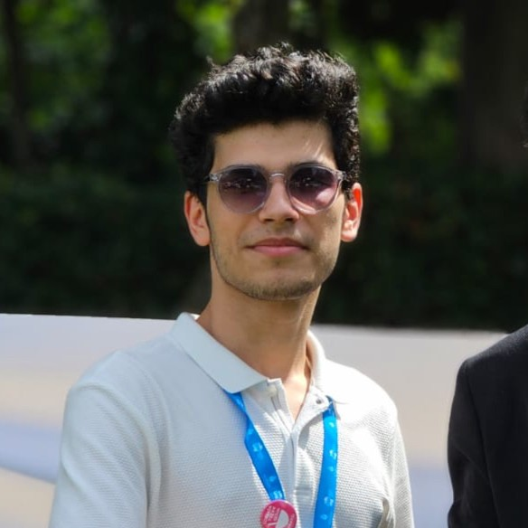

--- 
title: "SCODE: R and Python Workshop"
author: "Onur Keleş & Ömer Bayraklı"
date: "`r Sys.Date()`"
site: bookdown::bookdown_site
---

# Welcome to SCODE!

SCODE (Workshop on Open-Source Coding for Social Science) is a project by Onur Keleş and Ömer Bayraklı that aims to teach data science with Python and R to students from a social science background. The first edition of SCODE was completed in Summer 2022 at Yıldız Technical University and the second and most recent edition ended in Spring 2013 at Boğaziçi University, hosting more than 100 students, 5 guest lecturers and over 12 weeks of training. We collected all the training materials on this Github bookdown, free to use or re-produce. Enjoy the content! 

## Instructors 

{width="163"}

[Onur Keleş](http://linktr.ee/onrkls)

Onur Keleş is an M.A. student in the Department of Linguistics at Boğaziçi University, Istanbul, Turkey. He graduated from the Department of Foreign Language Education in July 2021. His main research interests include visual-gestural modality, quantitative linguistics, natural langauge processing and computational social science. He is currently employed as Research/Teaching Assistant in the Department of Linguistics at Boğaziçi University.

{width="163"}

[Ömer Bayraklı](http://twitter.com/omer_bayrakli/)

Ömer Bayraklı is an undergraduate student at the Department of Econometrics and Quantitative Economics at Istanbul University. He also worked as Data Science intern at Dejure AI, a legal tech startup and Finance Department intern at Ardic Cable Trays. His main research interests include quantitative economics, data science, statistics, and machine learning. 

## Structure of the book 

-   **Chapter 1** - Introduction to R programming

-   **Chapter 2** - Descriptive statistics with Tidyverse

-   **Chapter 3** - Inferential statistics (linear regression) 

-   **Chapter 4** - Twitter data analysis and RMarkdown

-  **Chapter 5** - Introduction to Python

- **Chapter 6** - Data analysis with pandas

- **Chapter 7** - Data visualization with matplotlib

- **Chapter 8** - Machine learning with scikit-learn

**Note:** This is a beginner course! If you already know advanced
statistics or R/Python, this workshop will not be for you!

## Acknowledgements

We would like to thank our guest lecturers for their contributions to the workshop:

- Mehmet Akıncı
- Didem Gündoğdu
- Onur Temiz
- Yunus Emre Gündoğmuş
- Karahan Şahin